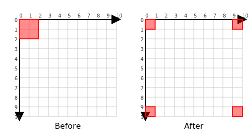

# GOKG

*aka "Golang kjkrol Geometry"*

**GOKG** is a Go toolkit focused on practical 2D computational geometry.
It splits into two packages: `geom` supplies numeric vectors (`Vec`), axis-aligned bounding boxes (`AABB`), and vector math; `plane` wraps those primitives in boundary-aware `Space2D` implementations (Euclidean2D and Toroidal2D) that keep boxes canonical to a surface. `plane.AABB` caches size and fragments so translations, wraps, and clamps obey the space’s rules without duplicating bookkeeping.
The library stays focused on mathematical geometry; rendering or UI concerns live in neighbouring packages.

## Space2D boundary handling

- Euclidean2D spaces clamp boxes to the viewport while keeping their size consistent, so expansions never bleed beyond the defined world.
- Toroidal2D spaces automatically wrap boxes that cross an edge and split them into fragments that continue on the opposite side, making toroidal worlds easy to model. Conceptually, glue the top edge of the plane to the bottom edge, then the left edge to the right; this seam-stitching turns the rectangle into the torus shown in the animation below.

  

- The helper methods `Translate` and `Expand` renormalise boxes on every call, updating cached fragments and ensuring touch/collision queries remain accurate without extra bookkeeping.

## Usage example

This snippet shifts a contiguous `plane.AABB` by `(-1,-1)` across a 10×10 toroidal `Space2D`, so the box wraps past the right and bottom edges and automatically splits into the fragments returned by `Fragments()`. The exact situation is illustrated by the plot below.



```go
package main

import (
	"fmt"

	"github.com/kjkrol/gokg/pkg/geom"
	"github.com/kjkrol/gokg/pkg/plane"
)

// Demonstrates how shifting a contiguous aabb beyond the toroidal plane boundary
// causes it to fragment into multiple wrapped pieces and prints those fragments.
func main() {
        toroidal := plane.NewToroidal2D(10, 10)

        box := geom.NewAABBAt(geom.NewVec(0, 0), 2, 2)
        aabb := toroidal.WrapAABB(box)

        shift := geom.NewVec(-1, -1)
        toroidal.Translate(&aabb, shift)

	fragments := aabb.Fragments()
	if len(fragments) < 3 {
		fmt.Printf("Unexpected fragment count (%d)\n", len(fragments))
		return
	}

	fmt.Printf("New position: %s\n", aabb)
	if fragment, ok := fragments[plane.FRAG_RIGHT]; ok {
		fmt.Printf("- Fragment %d: %s\n", plane.FRAG_RIGHT, fragment)
	}
	if fragment, ok := fragments[plane.FRAG_BOTTOM]; ok {
		fmt.Printf("- Fragment %d: %s\n", plane.FRAG_BOTTOM, fragment)
	}
	if fragment, ok := fragments[plane.FRAG_BOTTOM_RIGHT]; ok {
		fmt.Printf("- Fragment %d: %s\n", plane.FRAG_BOTTOM_RIGHT, fragment)
	}
	// Output:
	// New position: {(9,9) (10,10)}
	// - Fragment 0: {(0,9) (1,10)}
	// - Fragment 1: {(9,0) (10,1)}
	// - Fragment 2: {(0,0) (1,1)}
}
```

For more scenarios, browse the example-based tests under `pkg/plane` and `pkg/geom`, which double as runnable documentation.

## Projects using GOKG

- [`gokq`](https://github.com/kjkrol/gokq) — **GOKQ** is a quadtree utility library that relies on `geom.Vec`, `geom.AABB`, and `plane.AABB` operations.
- [`gokx`](https://github.com/kjkrol/gokx) — **GOKX** is a Go library that provides a lightweight experimental framework for 2D graphics applications.

----
*[Contributor Recommendations](doc/Contributor_Recommendations.md)
