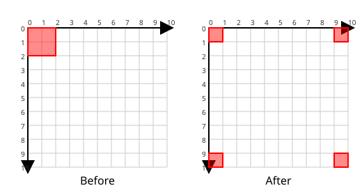

# aabbworld

<p align="center">
  <a href="https://go.dev"></a>
  <a href="https://pkg.go.dev/github.com/kjkrol/aabbworld"></a>
  <a href="https://opensource.org/licenses/MIT"></a>
</p>

**aabbworld** is a Go library for 2D worlds made of axis-aligned boxes (AABBs). It began as a set
of operations on the boxes themselves and grew upward from there: a plane with its own edge rules
(stop, wrap or open at each edge) and the transformations that move boxes on it, a spatial index
over the boxes placed in it, a collision engine that separates the ones that overlap, and a
line-of-sight scan. `Space` is the whole of it; `geom` and `plane` are its vocabulary.

<p align="center">
    <a href="#features">Features</a>
    &nbsp;&bull;&nbsp;
    <a href="#installation">Installation</a>
    &nbsp;&bull;&nbsp;
    <a href="#example">Example</a>
    &nbsp;&bull;&nbsp;
    <a href="#edges">Edges</a>
    &nbsp;&bull;&nbsp;
    <a href="#architecture">Architecture</a>
    &nbsp;&bull;&nbsp;
    <a href="BENCHMARKS.md">Benchmarks</a>
    &nbsp;&bull;&nbsp;
    <a href="#documentation">Documentation</a>
</p>

# Design Goals

aabbworld is the geometry and the per-tick questions of a simulation, with no opinion about how
the simulation stores its entities. It is built around a few principles:

- **The world is a slice.** A `Space` is told its items as `[]Item` — whose box, where it lies,
  what may be done with it — and answers questions about them. It fits under any entity system,
  or none.
- **No hidden costs.** `Rebuild` records the slice and defers indexing to the first query that
  needs it; several rebuilds in a tick cost one indexing. Boxes are read as they are now, so a
  collision tick needs no second rebuild for queries to see its pushes.
- **Zero-allocation hot paths.** Rebuilding, pairing, solving, querying and scanning reuse their
  buffers; a steady tick allocates nothing.
- **Edge rules are the plane's business.** Wrapping, clamping and leaving are applied by the
  `Space` to a box once, and every index and query understands the wrapped pieces that result.
- **Native Go**, one small dependency ([`kjkrol/uid`](https://github.com/kjkrol/uid)) for
  entity identifiers, no CGO.

<a id="installation"></a>
# 📦 Installation

aabbworld requires **Go 1.27** or newer.

```bash
go get github.com/kjkrol/aabbworld
```

<a id="features"></a>
# ✨ Key Features

| Area | What you get |
|:---|:---|
| **Boxes** | `geom.Vec`, `geom.AABB`: intersection, containment, penetration, axis distance |
| **Plane-aware boxes** | `plane.AABB` keeps its size and how far it runs past a wrapping seam; its wrapped pieces follow (`VisitFragments`, `DeepestOverlapWith`) |
| **Edge rules** | Per axis: stop whole, wrap (`WrapX`, `WrapY`, `Torus`) or open (`OpenX`, `OpenY`, boxes may leave) |
| **Transformations** | `Place`, `Move`, `MoveTo`, `WrapAABB` fold a box into the space under its edge rules and say when it has left |
| **Spatial index** | `Rebuild` from a slice, `Query` by rectangle and `Capability` mask, seams included |
| **Collisions** | `CollideEngine`: pairs every two `CanCollide` boxes within reach, asks your `Handler` to confirm each overlap, separates them over a few passes, reports who moved and who left |
| **Sight** | `Scan` fills a `View` with what an observer sees through a `Cone`: entities nearest first, depth samples, or the lit outline; `Cone.Transparency` lets a forest shorten sight where a wall cuts it; `Cone.Eye`, `Elevation` and `Ground` give sight heights, so a hawk looks over the wall and a hill hides the plain behind it |

<a id="example"></a>
# Example

One tick of a small world: move, rebuild, collide, then ask who is where and who sees whom.
This is [`ExampleSpace`](space_example_test.go) and runs as a test, so it stays in step with the API.

```go
package main

import (
	"fmt"
	"math"
	"slices"

	"github.com/kjkrol/aabbworld"
	"github.com/kjkrol/aabbworld/collide"
	"github.com/kjkrol/aabbworld/geom"
	"github.com/kjkrol/aabbworld/plane"
	"github.com/kjkrol/uid"
)

// printer is a collide.Handler that confirms every pair and says what the engine did.
type printer struct{}

func (printer) Touch(_, _ uid.UID64, pen geom.Vec) (geom.Vec, bool) { return pen, true }
func (printer) Contact(a, b uid.UID64, pen geom.Vec) {
	fmt.Printf("contact %d-%d, penetration %s\n", a, b, pen)
}
func (printer) Moved(id uid.UID64, box plane.AABB) { fmt.Printf("moved %d to %s\n", id, box) }

func main() {
	space, err := aabbworld.NewSpace(aabbworld.Config{
		Width: 100, Height: 100, Edges: aabbworld.Torus, BucketSize: 16,
	})
	if err != nil {
		panic(err)
	}

	// The world as a slice: whose box, where it lies, what may be done with it.
	items := []aabbworld.Item{
		{ID: 1, Box: plane.NewAABB(geom.NewVec(10, 10), 10, 10), Caps: aabbworld.CanCollide},
		{ID: 2, Box: plane.NewAABB(geom.NewVec(24, 10), 10, 10), Caps: aabbworld.CanCollide},
		{ID: 3, Box: plane.NewAABB(geom.NewVec(60, 10), 10, 10), Caps: aabbworld.CanCollide | aabbworld.Static},
	}
	for i := range items {
		space.Place(&items[i].Box)
	}
	engine := space.CollideEngine(printer{}, collide.Config{Reach: 0.5, Iterations: 8})

	// Tick: box 2 drifts left into box 1, the space is told, the engine separates them.
	space.Move(&items[1].Box, geom.NewVec(-6, 0))
	space.Rebuild(items)
	engine.Tick()

	// Query sees the boxes where the engine left them.
	var inQuarter []uid.UID64
	space.Query(geom.NewAABBAt(geom.NewVec(0, 0), 50, 50), aabbworld.AnyCapability, func(id uid.UID64) {
		inQuarter = append(inQuarter, id)
	})
	slices.Sort(inQuarter)
	fmt.Println("in the top-left quarter:", inQuarter)

	// Sight: what box 1 sees looking right.
	var view aabbworld.View
	cone := aabbworld.Cone{Direction: geom.NewVec(1, 0), HalfAngle: math.Pi / 8, Radius: 60}
	if space.Scan(1, cone, &view) {
		view.Entities(func(id uid.UID64, dist float64) { fmt.Printf("1 sees %d at distance %.0f\n", id, dist) })
	}
}
```

```
contact 1-2, penetration (-2,0)
moved 1 to {(9,10) (19,20)}
moved 2 to {(19,10) (29,20)}
in the top-left quarter: [1 2]
1 sees 2 at distance 5
```

## Tick lifecycle

1. **Move** the boxes with `Space.Move` (or `MoveTo`); the edge rules are applied to each.
2. **Rebuild** with the items as they now stand. This is the one stamp a `Space` needs: it records
   the slice and which id sits where, and indexes lazily.
3. **Tick** the engine. Every two `CanCollide` boxes within `Reach` of each other are paired; each
   overlapping pair is put to `Handler.Touch`, which may confirm it, refine the penetration, or veto
   it; confirmed pairs are separated over up to `Iterations` passes and reported by `Contact`; every
   pushed box is reported once by `Moved`, or listed by `Engine.Left` when the push took it out
   through an open edge.
4. **Ask.** `Query` and `Scan` see the pushed boxes as they are now.

Items must stay put between rebuilds — their boxes may move, but the slice may not grow, shrink or
reorder without a `Rebuild`.

<a id="edges"></a>
# Edges

`Edges` says what a box does at each edge of the world, per axis. The zero value stops it whole.
`WrapX` and `WrapY` make an axis periodic: a box leaving by one edge comes back through the
opposite one. `OpenX` and `OpenY` let a box leave; `Place` and `Move` return `false` once it is
wholly outside, and it drops out of the index. `Torus` wraps both axes. An axis cannot both wrap
and be open.

Conceptually a torus glues the top edge of the plane to the bottom, then the left edge to the
right; this seam-stitching turns the rectangle into the surface shown below.


A box straddling a seam is held as its main piece plus up to three wrapped pieces, and every
index and query understands them. This program moves a 2×2 box at the origin of a 16×16 torus by
`(-1,-1)`, so it wraps past the right and bottom edges and splits into the pieces plotted below
(it is [`ExampleSpace_Move`](space_translate_example_test.go)):



```go
space, _ := aabbworld.NewSpace(aabbworld.Config{Width: 16, Height: 16, Edges: aabbworld.Torus, BucketSize: 4})

items := []aabbworld.Item{{ID: uid.UID64(1), Box: space.WrapAABB(geom.NewAABBAt(geom.NewVec(0, 0), 2, 2))}}
box := &items[0].Box
space.Move(box, geom.NewVec(-1, -1))
space.Rebuild(items)

fmt.Printf("New position: %s\n", box)
box.VisitFragments(func(pos plane.FragPosition, piece geom.AABB) bool {
	fmt.Printf("- Fragment %d: %s\n", pos, piece)
	return true
})
```

```
New position: {(15,15) (16,16)}
- Fragment 1: {(0,15) (1,16)}
- Fragment 2: {(15,0) (16,1)}
- Fragment 3: {(0,0) (1,1)}
```

<a id="architecture"></a>
# Architecture

The packages form a strict acyclic graph; each imports only the layers below it. Every package has
a `doc.go` describing what it brings.

| Package | Responsibility |
|:---|:---|
| [`github.com/kjkrol/uid`](https://pkg.go.dev/github.com/kjkrol/uid) | 64-bit generational entity identifiers; a `Space` never mints one, it only names what it was told |
| [`geom`](geom/doc.go) | The vocabulary: `Vec` and `AABB`, with intersection, containment, penetration and axis distance; no notion of a world |
| [`plane`](plane/doc.go) | A box as a `Space` holds it: `AABB` with a `Size` and an `Overhang`, its wrapped pieces (`VisitFragments`), the deepest `Overlap` of two boxes |
| [`internal/plane`](internal/plane/doc.go) | The surface behind a `Space`: `Edges` rules and what they do to a box — `Translate`, `Expand`, `WrapAABB`, `Left` |
| [`internal/spatial`](internal/spatial/doc.go) | The index: `Grid` over a slice of items with lazily built cells for `Query` and a counting-sorted sweep for `Pairs`; `Capability`, `Resolution` |
| [`internal/raycast`](internal/raycast/doc.go) | Sight: a cone scan over any queryable index — the angular sweep, shadows, and the `View` it fills |
| [`collide`](collide/doc.go) | The public contract of a collision engine: `Config`, `Handler`, `Engine` |
| [`internal/collide`](internal/collide/doc.go) | The engine behind it: `Pairs` from the grid → `Solver` → `Handler`, and who `Left` through an open edge |
| [`aabbworld`](doc.go) (public) | The package you import: `Space`, `Item`, `Capability`, `Edges`, `Config`, `View`, `Cone`; wires the rest together |

```
geom ──► plane ──► internal/plane ──► internal/spatial ──► internal/collide ──┐
  │        │                                                                  ├─► aabbworld
  │        └──► collide ──────────────────────────────────────────────────────┤
  └───────────► internal/raycast ─────────────────────────────────────────────┘
```

<a id="performance"></a>
# ⏱️ Performance

Measured on an Intel i5-8265U (see [BENCHMARKS.md](BENCHMARKS.md#environment)); every path below
reports 0 allocs/op.

| Operation | Scene | Cost |
|:---|:---|---:|
| Collision tick (pair, ask, separate) | 8,388 boxes, 10×10 each, covering 20% of a 2048×2048 torus | 1.78 ms |
| Collision tick | 33,554 boxes, 5×5 each, covering 20% of the same torus | 8.6 ms |
| Rebuild + pairs + 8 queries | 8,388 boxes, 5×5 each, on a 1024×1024 torus | 1.23 ms |
| Solve confirmed pairs | 13,547 candidate pairs, 3,763 contacts | 4.25 ms |
| Scan a 90° cone and list what it sees | 1,000 entities in sight range | 26.7 µs |
| Scan a 90° cone through see-through entities, list and outline | 1,000 entities, 3 in 10 at τ = 0.5 | 32.4 µs |
| The same scan with heights over a 32-unit heightfield | 1,000 entities, 3 in 10 at τ = 0.5, ground sampled every 32 | 112 µs (3.2× the scan without heights) |
| Fold a box across the far corner (`WrapAABB`) | torus | 31 ns |

> **Deep dive**: per-scene tables, what each benchmark measures, and what the numbers taught us
> (why the index keeps two layouts, why `Rebuild` is lazy) are in [**BENCHMARKS.md**](BENCHMARKS.md).

```bash
make bench
```

# Projects using aabbworld

- [`gram`](https://github.com/kjkrol/gram) — a game engine over the [GOKe](https://github.com/kjkrol/goke)
  ECS and Ebitengine (formerly gokebiten); its world, collision and vision plugins are built on
  `Space`.

<a id="documentation"></a>
# 📖 Documentation

- **API reference** on [pkg.go.dev](https://pkg.go.dev/github.com/kjkrol/aabbworld).
- **Concepts and package graph** in the root [`doc.go`](doc.go); each package's own `doc.go`
  explains what it brings (see [Architecture](#architecture)).
- **Benchmarks** in [BENCHMARKS.md](BENCHMARKS.md); **changes** in [CHANGELOG.md](CHANGELOG.md).

# Contributing

Commit prefixes and conventions are in [Contributor Recommendations](doc/Contributor_Recommendations.md).

# License

[MIT](LICENSE)
